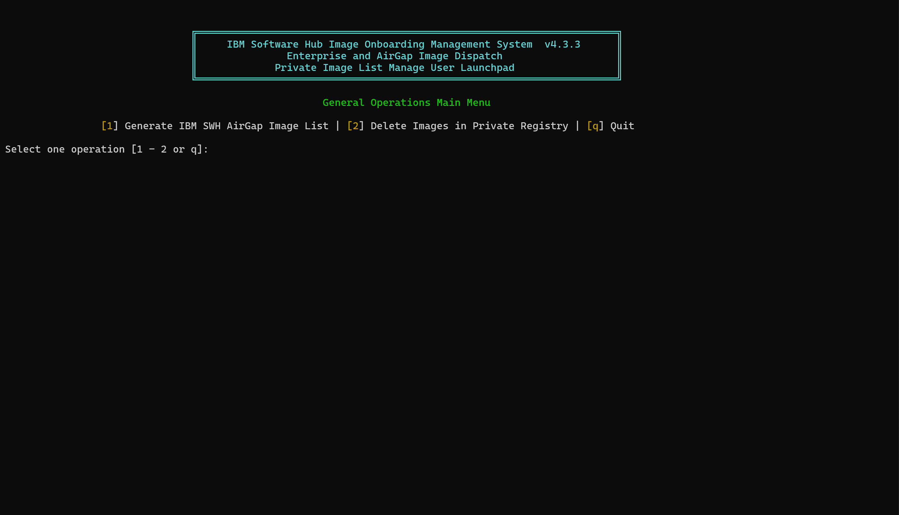
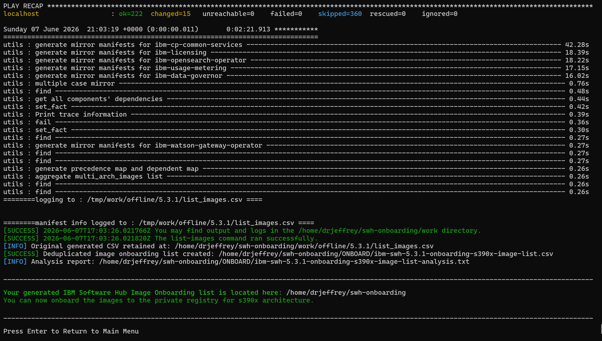
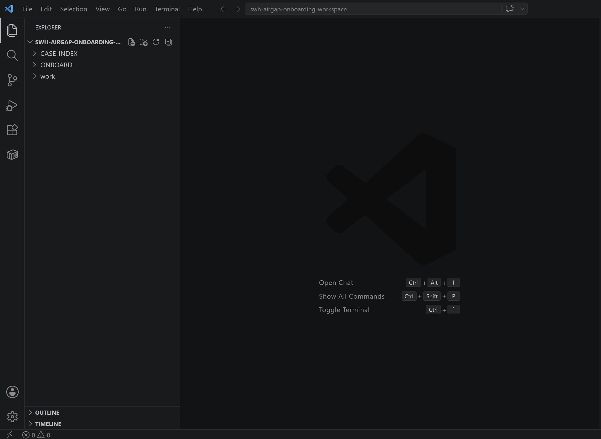

### IBM Software Hub Enterprise Image Onboarding Aid 

IBM SWH Manager Installer 

The IBM SWH Image Manager helps IBM customers install IBM watsonx Assistant for Z, IBM watsonx Orchestrate, IBM watsonx Code Assistant for Z, and as well as other watsonx services (e.g. wxa4z, openpages, cognos analytics, et al) on the Enterprise platform by standardizing and automating the container-image preparation that must occur before IBM Software Hub operators and watsonx Orchestrate and other services workloads can be deployed successfully. In a connected enterprise environment, the image manager can centralize registry definitions, product versions, repository paths, credentials, and image references so that the correct watsonx Orchestrate and IBM Software Hub images are available to the target Red Hat OpenShift cluster. This reduces manual image handling, minimizes version drift, and lowers the risk of deployment failures such as missing images, invalid tags, authentication errors, or inconsistent registry configuration. By establishing a repeatable image-management layer ahead of the cpd-cli and operator installation stages, it improves installation readiness, reproducibility, and lifecycle management across development, test, staging, and production environments.

For AirGap and restricted-network environments, the IBM SWH Image Manager is even more valuable because the OpenShift cluster cannot directly pull required software from IBM public registries. The manager provides the operational framework for obtaining the approved IBM Software Hub and watsonx Orchestrate image set from a connected location, mirroring those images into an enterprise-controlled private registry, and validating that the disconnected cluster can resolve and pull them before installation begins. This supports customer security policies, supply-chain governance, image scanning, auditability, and controlled promotion of software artifacts while eliminating dependence on outbound internet access during deployment. As a result, IBM customers can install and maintain watsonx Orchestrate in highly regulated, isolated, or sovereign environments with greater consistency, fewer image-related failures, and a safer, more predictable path for upgrades and ongoing platform maintenance.


-------------------------------------------------------------

##### xLaunchpad View



----------------------------------------------------------

### What the launcher asks

When you run `xLaunchpad.sh`, after filling settings.sh source, it asks:

1. IBM Software Hub version, stored as `VERSION`.
2. Comma-separated components list, stored as `COMPONENTS`.
3. Target architecture:
   - `1` for `amd64`
   - `2` for `s390x`
   - `3` for `ppc64le`
   - `q` to quit

The worker checks that `cpd-cli` is installed and extracts the IBM Software Hub release version from `cpd-cli version`. If the entered `VERSION` does not match the installed `cpd-cli` IBM Software Hub release version, the worker exits with code `0` and tells the user to install the correct `cpd-cli` version from:

```text
https://github.com/IBM-Software-Hub/ibm-software-hub-cpd-cli-install
```

### How to use

Prerequisites:

1) Install the following linux tools:
- `cpd-cli` - IBM Software Hub CLI tool for managing workspaces and airgap images.
   - Use this link:
      ```text  
         https://github.com/IBM-Software-Hub/ibm-software-hub-cpd-cli-install
      ```
- `jq` - Command-line JSON processor for parsing and manipulating JSON data.
- `enscript` - For printing the analysis report in a readable format.
- `ps2pdf` - For converting the analysis report to PDF format.
- `dos2unix` - For converting text files with DOS line endings to Unix line endings.

2) Clone and enter the directory:

```bash
git clone https://github.com/schijioke-uche/ibm-swh-image-onboard-manager.git
cd ibm-swh-image-onboard-manager && cp settings.sh.d settings.sh
```

Fill out the variable source file by entering edit mode:
```bash
vi settings.sh
```


3) Make scripts executable:

```bash
chmod +x xLaunchpad.sh ibm_swh_image_onboard.sh
chmod 700 settings.sh
```

4) Run the launchpad:

```bash
./xLaunchpad.sh
```

### Output

The script uses `CPD_CLI_MANAGE_WORKSPACE`. If it is not already set, the default is:

```text
$HOME/swh-image-onboarding-workspace
```

The manager writes airgap images as `list_images.csv` under:

```text
${CPD_CLI_MANAGE_WORKSPACE}/work/offline/${VERSION}/list_images.csv
```

The `manager` work performs the following operations:

1. Generates the enterprise airgap image list.
2. Applies `chmod -R 777` to `${CPD_CLI_MANAGE_WORKSPACE}`.
3. Searches the workspace for the generated CSV.
4. Retains the original CSV for records.
5. Deduplicates the list with `analyze_and_deduplicate_list()`.
6. Writes the final onboarding file as:

```text
${CPD_CLI_MANAGE_WORKSPACE}/ONBOARD/ibm-swh-${VERSION}-onboarding-${ARCH}-image-list.csv
```

It also writes an analysis report as receipt:

```text
${CPD_CLI_MANAGE_WORKSPACE}/ONBOARD/ibm-swh-${VERSION}-onboarding-${ARCH}-image-list-analysis.txt
```



-------------------------------------------------------------------



--------------------------------------------------------------------

### Component validation

The worker contains `COMPONENT_VALIDATE_ARRAY` using IBM Software Hub component IDs from IBM documentation. If any component entered by the user is not found in the array, the worker exits and prints this documentation link - Review the IBM component ID documentation:

```text
https://www.ibm.com/docs/en/software-hub/5.1.x?topic=manage-component-ids
```


-----------

##### Author
Dr. Jeffrey Chijioke-Uche <br>
IBM Computer Scientist
